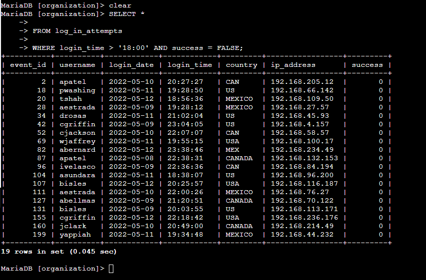
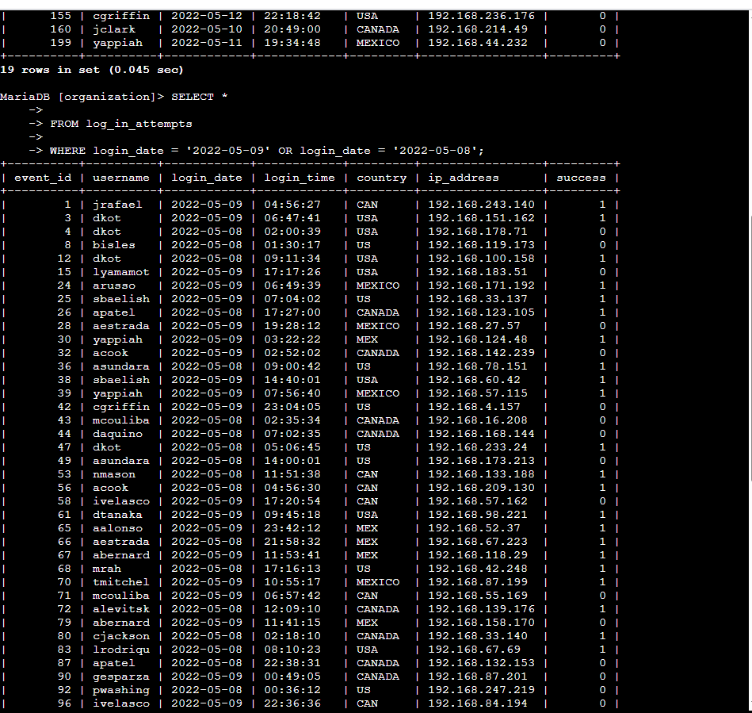
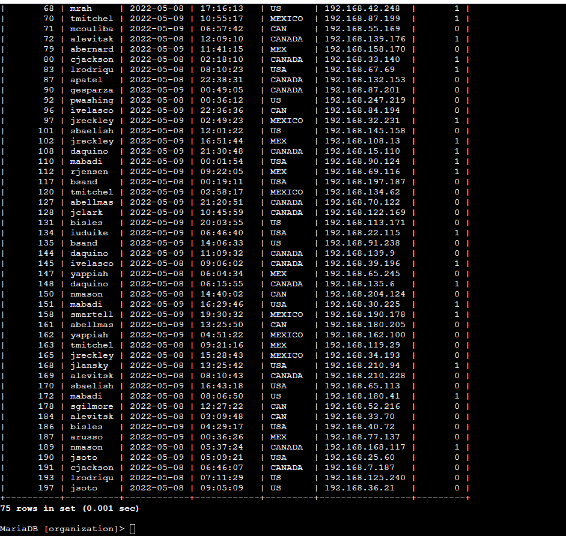
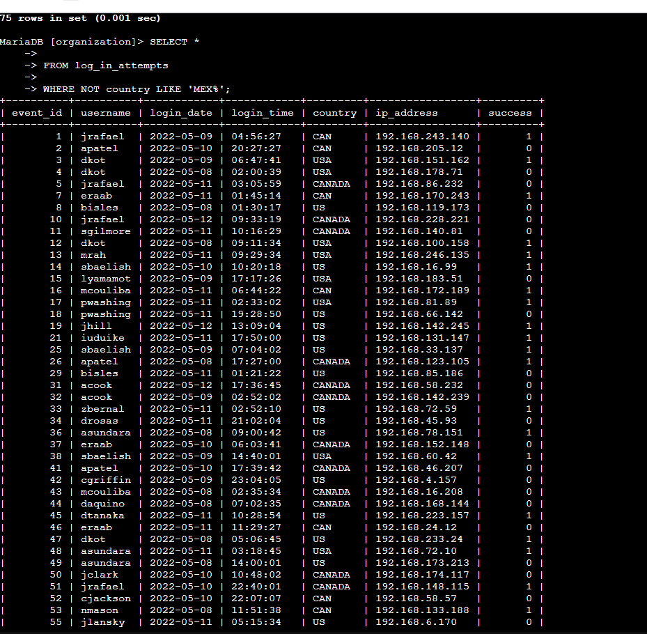
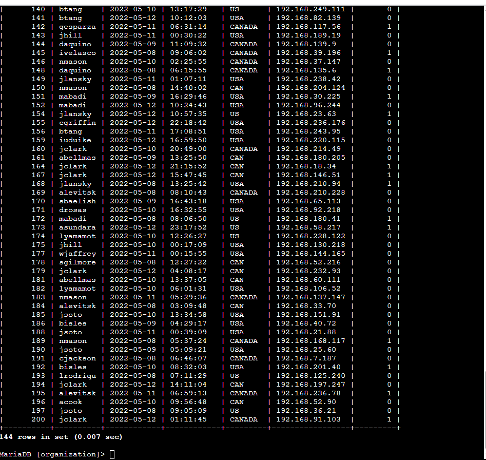
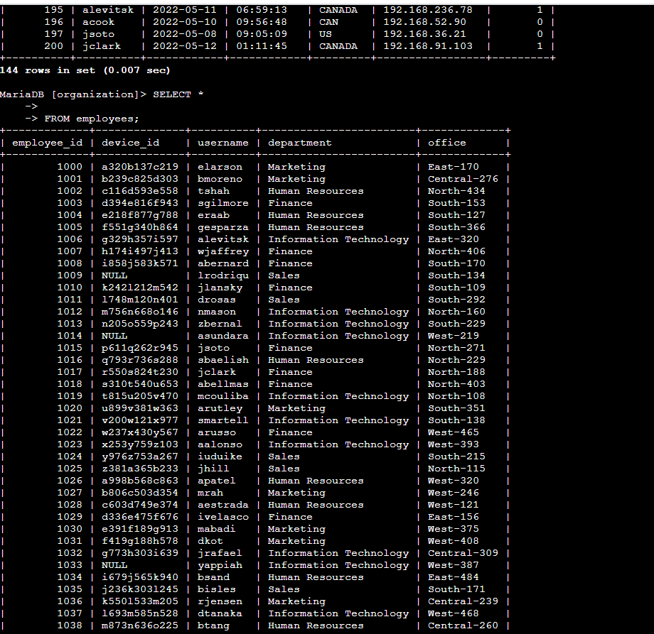
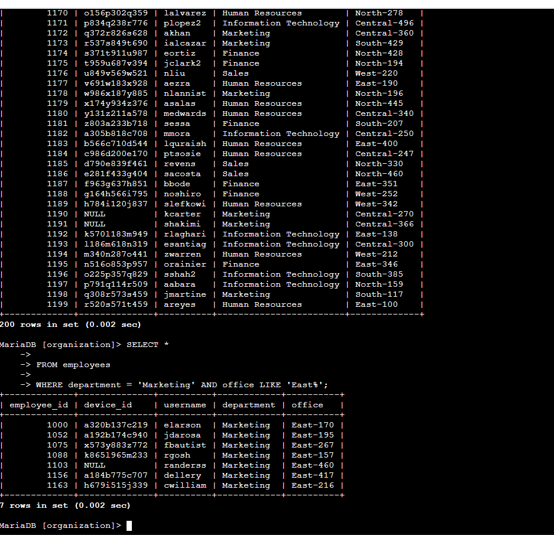
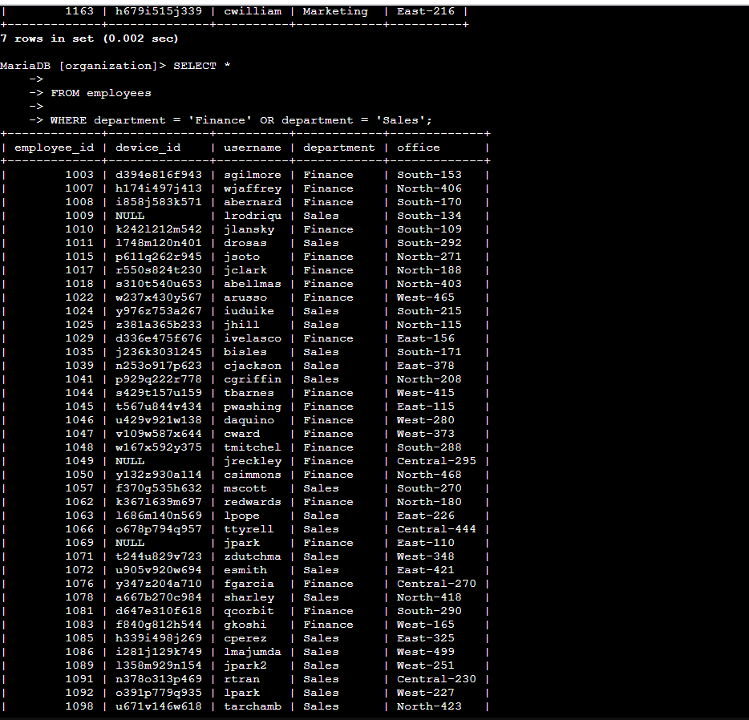
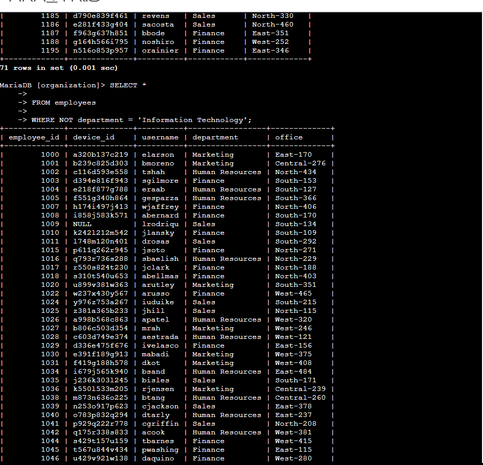
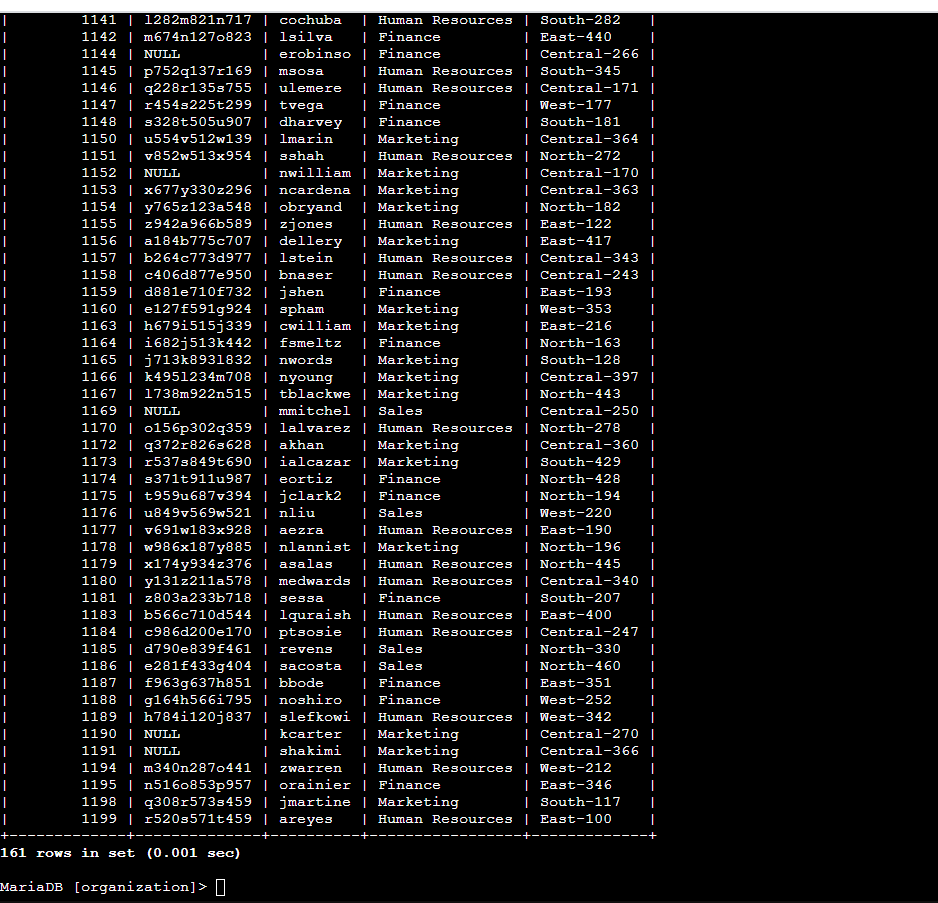

# 📊 Aplicar Filtros a Consultas SQL

Este projeto demonstra a aplicação prática de filtros em consultas SQL utilizando os operadores **AND**, **OR** e **NOT**, assim como o uso de **LIKE** e filtros de data/hora.

O conteúdo faz parte do meu portfólio de **Segurança Cibernética**, com o objetivo de registrar consultas SQL utilizadas para investigar possíveis incidentes de segurança.

---

## 🧠 Objetivo
- Praticar **filtros avançados** em **SQL** para **investigações de segurança**.
- Demonstrar **consultas** que **retornam dados específicos** com base em **múltiplas condições**.
- Incluir **evidências visuais** (**prints**) para facilitar a compreensão.

---

## 📂 Estrutura

- `img/` → Contém os **prints** de tela das consultas realizadas.
- `README.md` → Este documento.
- `modelos_exemplo/` → Arquivos contendo exemplos de consultas e instruções pra esse projeto.

---

## 📸 Consultas Realizadas

### 1️⃣ Recuperar tentativas de login com falha após as 18h

### 2️⃣ Recuperar tentativas de login em datas específicas

### 3️⃣ Recuperar tentativas de login fora do México

### 4️⃣ Recuperar funcionários do departamento de Marketing no edifício East

### 5️⃣ Recuperar funcionários dos departamentos de Finanças ou Vendas

### 6️⃣ Recuperar funcionários que **não** estão no departamento de TI

---

## 🧾 Descrição do Projeto
Este projeto apresenta **consultas SQL** criadas para **analisar dados** de **tentativas de login** e **informações de funcionários** com base em diferentes **critérios de filtragem**. Foram utilizados **operadores lógicos**, padrões com **LIKE** e filtros por **data/hora**.

---

## 📌 Resumo
A partir de um cenário de investigação de incidentes de segurança, foram aplicados filtros SQL para identificar tentativas de login suspeitas, atividades vindas de países específicos e informações sobre funcionários para aplicação de atualizações de segurança. Este documento serve como registro técnico no meu portfólio de **Segurança Cibernética**.

---

✍️ **Autor:** **Marcelo Rodrigues**
